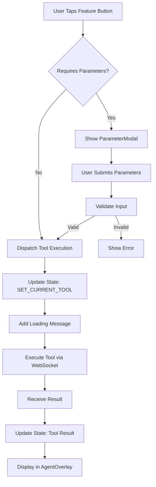
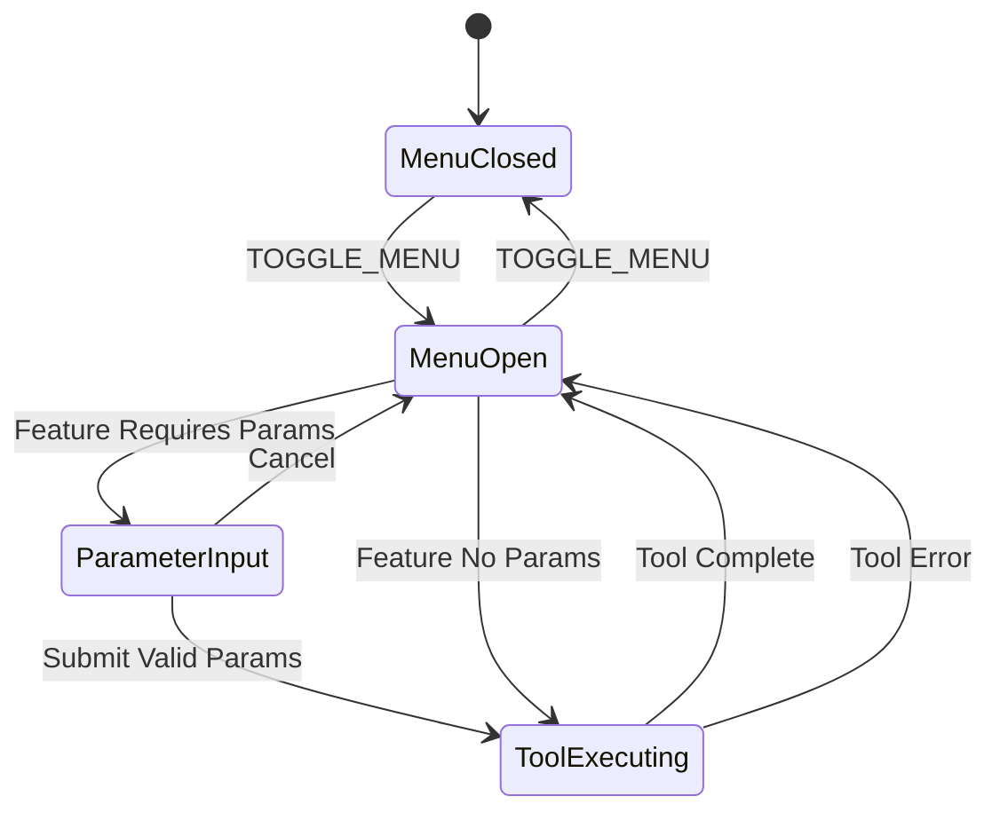

# Design Document: Feature Discoverability UI

## Overview

The Feature Discoverability UI adds visible navigation to the Mirra voice agent app, allowing users to discover and access all 13 available features through buttons and menus. This design maintains the voice-first experience as primary while providing a complementary visual interface for feature discovery and activation.

### Design Goals

1. **Discoverability**: Make all 13 features visible and understandable without voice commands
2. **Non-Interference**: Preserve existing voice-first workflow and UI layers (Voice Orb, Camera, Agent Overlay)
3. **Mobile-First**: Optimize for touch interactions on PWA with safe area support
4. **Design Consistency**: Follow Lumina Ethos design system (glassmorphism, light mode)
5. **Dual Access**: Support both voice and button activation with identical behavior

### Key Design Decisions

**Menu Positioning**: Top hamburger menu chosen over side drawer or floating action menu
- **Rationale**: Voice Orb occupies bottom center (z-20), Agent Overlay uses bottom 20-60% (z-30). Top positioning avoids conflicts and maintains visual hierarchy with Voice Orb as primary interaction point.

**Component Architecture**: Three-component system (FeatureMenu, FeatureButton, ParameterModal)
- **Rationale**: Separation of concerns - container manages visibility/state, buttons handle individual features, modal collects parameters. Enables independent testing and reusability.

**State Management**: Extend existing AppProvider reducer pattern
- **Rationale**: Maintains consistency with existing state architecture. Avoids introducing new state management patterns.

**Icon System**: Lucide React icons
- **Rationale**: Modern, tree-shakeable, extensive icon library with consistent design. Better performance than Material Symbols for React applications.

**Animation Strategy**: Slide-down from top with backdrop blur
- **Rationale**: Natural reveal pattern for top-positioned menu. Backdrop blur maintains glassmorphism aesthetic and focuses attention on menu.

**Parameter Input**: Modal overlay for features requiring parameters
- **Rationale**: Separates parameter collection from feature activation. Provides focused input experience without cluttering menu.

## Architecture

### Component Hierarchy

```
HomePage
├── CameraLayer (z-10)
├── StatusBar (z-20)
├── FeatureMenu (z-40) ← NEW
│   ├── MenuToggle
│   ├── MenuPanel
│   │   ├── CategorySection (Beauty Analysis)
│   │   │   └── FeatureButton[]
│   │   ├── CategorySection (Virtual Try-On)
│   │   │   └── FeatureButton[]
│   │   ├── CategorySection (Shopping)
│   │   │   └── FeatureButton[]
│   │   ├── CategorySection (Context)
│   │   │   └── FeatureButton[]
│   │   └── CategorySection (Closet)
│   │       └── FeatureButton[]
│   └── ParameterModal (z-50) ← NEW
├── AgentOverlay (z-30)
└── VoiceOrb (z-20)
```

### Data Flow



### State Management Flow



## Components and Interfaces

### FeatureMenu Component

**Purpose**: Container component managing menu visibility, feature activation, and parameter collection.

**Props**:
```typescript
interface FeatureMenuProps {
  // No props - uses AppProvider context
}
```

**State** (via AppProvider):
```typescript
interface MenuState {
  isMenuVisible: boolean;
  activeFeature: ToolName | null;
  showParameterModal: boolean;
}
```

**Actions**:
```typescript
| { type: "TOGGLE_MENU" }
| { type: "SET_MENU_VISIBLE"; payload: boolean }
| { type: "SET_ACTIVE_FEATURE"; payload: ToolName | null }
| { type: "SHOW_PARAMETER_MODAL"; payload: boolean }
```

**Behavior**:
- Renders MenuToggle button (hamburger icon) in top-left corner
- Renders MenuPanel when `isMenuVisible === true`
- Renders ParameterModal when `showParameterModal === true`
- Handles feature activation by dispatching appropriate actions
- Maintains menu visibility preference in session (not persisted)

**Styling**:
- MenuToggle: Fixed position top-left, z-40, glassmorphism, 44x44px touch target
- MenuPanel: Fixed position top-0, full-width on mobile, slide-down animation (300ms)
- Backdrop: Semi-transparent overlay with backdrop-blur when menu open

### FeatureButton Component

**Purpose**: Individual feature button with icon, label, and loading state.

**Props**:
```typescript
interface FeatureButtonProps {
  tool: ToolName;
  icon: LucideIcon;
  label: string;
  description?: string;
  requiresParams: boolean;
  isLoading: boolean;
  isDisabled: boolean;
  onClick: () => void;
}
```

**Behavior**:
- Displays icon (24px) and label
- Shows loading spinner when `isLoading === true`
- Disables interaction when `isDisabled === true` or `isLoading === true`
- Calls `onClick` handler on tap/click
- Provides visual feedback (scale, opacity) on press

**Styling**:
- Glassmorphism card with hover/active states
- Minimum 44x44px touch target
- Icon color: `var(--on-surface)`
- Label: Inter font, 14px, `var(--on-surface)`
- Description: Inter font, 12px, `var(--on-surface-variant)`

### ParameterModal Component

**Purpose**: Modal overlay for collecting feature parameters (URLs, text, location).

**Props**:
```typescript
interface ParameterModalProps {
  tool: ToolName;
  onSubmit: (params: Record<string, string>) => void;
  onCancel: () => void;
}
```

**Parameter Configurations**:
```typescript
const PARAMETER_CONFIGS: Record<ToolName, ParameterConfig> = {
  [ToolName.TRY_ON_CLOTHES]: {
    fields: [{ name: "garment_url", type: "url", label: "Garment Image URL", placeholder: "https://example.com/image.jpg", required: true }]
  },
  [ToolName.TRY_ON_EARRINGS]: {
    fields: [{ name: "earring_url", type: "url", label: "Earring Image URL", placeholder: "https://example.com/earrings.jpg", required: true }]
  },
  [ToolName.TRY_ON_NECKLACE]: {
    fields: [{ name: "necklace_url", type: "url", label: "Necklace Image URL", placeholder: "https://example.com/necklace.jpg", required: true }]
  },
  [ToolName.TRY_ON_HAIRSTYLE]: {
    fields: [{ name: "hairstyle_url", type: "url", label: "Hairstyle Image URL", placeholder: "https://example.com/hairstyle.jpg", required: true }]
  },
  [ToolName.SEARCH_PRODUCTS]: {
    fields: [{ name: "query", type: "text", label: "Search Query", placeholder: "red lipstick", required: true }]
  },
  [ToolName.GET_WEATHER]: {
    fields: [{ name: "location", type: "text", label: "Location", placeholder: "San Francisco, CA", required: false }]
  }
};
```

**Validation**:
- URL fields: Validate format using `URL` constructor
- Text fields: Trim whitespace, minimum 1 character
- Display inline error messages below invalid fields

**Behavior**:
- Renders full-screen modal overlay (z-50)
- Displays input fields based on tool configuration
- Validates input on submit
- Calls `onSubmit` with validated parameters
- Calls `onCancel` on backdrop click or cancel button
- Supports keyboard navigation (Tab, Enter, Escape)

**Styling**:
- Backdrop: `rgba(0, 0, 0, 0.4)` with `backdrop-blur(8px)`
- Modal card: Glassmorphism, centered, max-width 400px, slide-up animation
- Input fields: Lumina Ethos form styling, 44px height

### CategorySection Component

**Purpose**: Groups related features under a category header.

**Props**:
```typescript
interface CategorySectionProps {
  title: string;
  features: FeatureConfig[];
  isLoading: (tool: ToolName) => boolean;
  onFeatureClick: (tool: ToolName, requiresParams: boolean) => void;
}
```

**Behavior**:
- Renders category title with label-caps styling
- Renders grid of FeatureButton components
- Responsive grid: 1 column (mobile), 2 columns (tablet), 3 columns (desktop)

## Data Models

### Feature Configuration

```typescript
interface FeatureConfig {
  tool: ToolName;
  icon: LucideIcon;
  label: string;
  description: string;
  category: FeatureCategory;
  requiresParams: boolean;
}

enum FeatureCategory {
  BEAUTY_ANALYSIS = "Beauty Analysis",
  VIRTUAL_TRY_ON = "Virtual Try-On",
  SHOPPING = "Shopping",
  CONTEXT = "Context",
  CLOSET = "Closet"
}

const FEATURE_CATALOG: FeatureConfig[] = [
  // Beauty Analysis
  {
    tool: ToolName.ANALYZE_SKIN,
    icon: Sparkles,
    label: "Analyze Skin",
    description: "Get detailed skin analysis",
    category: FeatureCategory.BEAUTY_ANALYSIS,
    requiresParams: false
  },
  {
    tool: ToolName.GET_SKIN_TONE,
    icon: Palette,
    label: "Detect Skin Tone",
    description: "Find your skin tone and undertone",
    category: FeatureCategory.BEAUTY_ANALYSIS,
    requiresParams: false
  },
  {
    tool: ToolName.GET_FACE_ATTRIBUTES,
    icon: ScanFace,
    label: "Face Attributes",
    description: "Analyze facial features",
    category: FeatureCategory.BEAUTY_ANALYSIS,
    requiresParams: false
  },
  
  // Virtual Try-On
  {
    tool: ToolName.TRY_ON_CLOTHES,
    icon: Shirt,
    label: "Try On Clothes",
    description: "Virtual clothing try-on",
    category: FeatureCategory.VIRTUAL_TRY_ON,
    requiresParams: true
  },
  {
    tool: ToolName.TRY_ON_MAKEUP,
    icon: Sparkles,
    label: "Try On Makeup",
    description: "Virtual makeup application",
    category: FeatureCategory.VIRTUAL_TRY_ON,
    requiresParams: false
  },
  {
    tool: ToolName.TRY_ON_EARRINGS,
    icon: Circle,
    label: "Try On Earrings",
    description: "Virtual earring try-on",
    category: FeatureCategory.VIRTUAL_TRY_ON,
    requiresParams: true
  },
  {
    tool: ToolName.TRY_ON_NECKLACE,
    icon: Gem,
    label: "Try On Necklace",
    description: "Virtual necklace try-on",
    category: FeatureCategory.VIRTUAL_TRY_ON,
    requiresParams: true
  },
  {
    tool: ToolName.TRY_ON_HAIRSTYLE,
    icon: Scissors,
    label: "Change Hairstyle",
    description: "Virtual hairstyle try-on",
    category: FeatureCategory.VIRTUAL_TRY_ON,
    requiresParams: true
  },
  
  // Shopping
  {
    tool: ToolName.SEARCH_PRODUCTS,
    icon: Search,
    label: "Search Products",
    description: "Find beauty products",
    category: FeatureCategory.SHOPPING,
    requiresParams: true
  },
  
  // Context
  {
    tool: ToolName.GET_WEATHER,
    icon: Cloud,
    label: "Check Weather",
    description: "Get weather for outfit planning",
    category: FeatureCategory.CONTEXT,
    requiresParams: false
  },
  {
    tool: ToolName.GET_CALENDAR,
    icon: Calendar,
    label: "Check Calendar",
    description: "View upcoming events",
    category: FeatureCategory.CONTEXT,
    requiresParams: false
  },
  
  // Closet
  {
    tool: ToolName.CHECK_CLOSET,
    icon: Hanger,
    label: "Check Closet",
    description: "View your saved items",
    category: FeatureCategory.CLOSET,
    requiresParams: false
  },
  {
    tool: ToolName.MATCH_CLOSET,
    icon: Shuffle,
    label: "Match Closet",
    description: "Find matching outfits",
    category: FeatureCategory.CLOSET,
    requiresParams: false
  },
  {
    tool: ToolName.GENERATE_PROOF_CARD,
    icon: FileCheck,
    label: "Generate Proof Card",
    description: "Create outfit proof card",
    category: FeatureCategory.CLOSET,
    requiresParams: false
  }
];
```

### Extended App State

```typescript
interface AppState {
  // ... existing fields
  menu: {
    isVisible: boolean;
    activeFeature: ToolName | null;
    showParameterModal: boolean;
  };
}
```

### Extended App Actions

```typescript
type AppAction =
  | ... existing actions
  | { type: "TOGGLE_MENU" }
  | { type: "SET_MENU_VISIBLE"; payload: boolean }
  | { type: "SET_ACTIVE_FEATURE"; payload: ToolName | null }
  | { type: "SHOW_PARAMETER_MODAL"; payload: boolean };
```

## Error Handling

### Input Validation Errors

**Scenario**: User submits invalid parameter (malformed URL, empty text)

**Handling**:
1. Validate input in ParameterModal before submission
2. Display inline error message below invalid field
3. Prevent form submission until valid
4. Error message examples:
   - "Please enter a valid URL"
   - "This field is required"
   - "Location must be at least 2 characters"

### Tool Execution Errors

**Scenario**: Backend returns error during tool execution

**Handling**:
1. Remove loading state from FeatureButton
2. Re-enable button for retry
3. Display error message in AgentOverlay (existing error handling)
4. Log error to console for debugging

### WebSocket Connection Errors

**Scenario**: WebSocket disconnected when user taps feature button

**Handling**:
1. Check `isConnected` state before tool execution
2. Display toast notification: "Not connected. Tap the mic to connect."
3. Do not execute tool until connection established
4. Maintain existing reconnection logic in useVoiceAgent hook

### Missing Selfie Error

**Scenario**: User taps feature button before selfie captured

**Handling**:
1. Check `state.selfie` before tool execution
2. Display toast notification: "Please wait for camera to initialize"
3. Do not execute tool until selfie available

## Testing Strategy

### Unit Tests

**Component Tests** (React Testing Library):
- FeatureMenu: Renders all 13 features, groups by category, toggles visibility
- FeatureButton: Displays icon/label, handles click, shows loading state
- ParameterModal: Renders correct fields per tool, validates input, calls onSubmit/onCancel
- CategorySection: Renders category title, renders feature buttons in grid

**State Management Tests**:
- Reducer: TOGGLE_MENU action, SET_ACTIVE_FEATURE action, SHOW_PARAMETER_MODAL action
- Action creators: createFeatureActivation, createParameterSubmission

**Validation Tests**:
- URL validation: Valid URLs pass, invalid URLs fail
- Text validation: Non-empty strings pass, empty/whitespace-only strings fail
- Required field validation: Missing required fields prevent submission

### Integration Tests

**Feature Activation Flow**:
1. User opens menu → Menu visible
2. User taps feature (no params) → Tool executes, loading state shown
3. Tool completes → Result displayed in AgentOverlay, loading state removed

**Parameter Collection Flow**:
1. User taps feature (requires params) → ParameterModal shown
2. User enters invalid input → Error message shown, submission prevented
3. User enters valid input → Modal closes, tool executes

**Voice-Button Parity**:
1. Trigger tool via voice command → Loading state shown in menu
2. Trigger tool via button → Same loading state, same result display
3. Verify both paths produce identical state changes

### Accessibility Tests

**Keyboard Navigation**:
- Tab through menu items → Focus indicators visible
- Enter on feature button → Feature activates
- Escape in ParameterModal → Modal closes

**Screen Reader Tests**:
- Menu toggle → Announces "Menu" and "expanded/collapsed" state
- Feature buttons → Announces label and description
- Loading states → Announces "Loading [feature name]"
- Parameter modal → Announces field labels and error messages

**Color Contrast Tests**:
- Verify all text meets WCAG AAA (7:1 for normal, 4.5:1 for large)
- Test with Chrome DevTools Lighthouse accessibility audit

### Visual Regression Tests

**Responsive Layouts**:
- Mobile (375px): Single column, full-width menu
- Tablet (768px): Two-column grid
- Desktop (1440px): Three-column grid

**Animation Tests**:
- Menu open: Slide-down animation smooth (300ms)
- Menu close: Slide-up animation smooth (300ms)
- Button press: Scale/opacity feedback visible

### Manual Testing Checklist

- [ ] All 13 features visible in menu
- [ ] Features grouped correctly by category
- [ ] Menu toggles open/closed smoothly
- [ ] Feature buttons have 44x44px touch targets
- [ ] Parameter modal appears for correct features
- [ ] Input validation works for all field types
- [ ] Loading states sync between voice and button activation
- [ ] Menu doesn't obscure Voice Orb or Agent Overlay
- [ ] Safe area insets respected on iPhone X+
- [ ] Glassmorphism styling consistent with design system
- [ ] Icons render correctly at all sizes
- [ ] Keyboard navigation works throughout
- [ ] Screen reader announces all states correctly

## Implementation Notes

### Icon Mapping

Use Lucide React icons for all features:

```typescript
import {
  Sparkles,      // analyze_skin, try_on_makeup
  Palette,       // get_skin_tone
  ScanFace,      // get_face_attributes
  Shirt,         // try_on_clothes
  Circle,        // try_on_earrings
  Gem,           // try_on_necklace
  Scissors,      // try_on_hairstyle
  Search,        // search_products
  Cloud,         // get_weather
  Calendar,      // get_calendar
  Hanger,        // check_closet (use ShoppingBag if Hanger unavailable)
  Shuffle,       // match_closet
  FileCheck      // generate_proof_card
} from "lucide-react";
```

### Z-Index Layering

```
z-10: CameraLayer (background)
z-20: StatusBar, VoiceOrb (persistent UI)
z-30: AgentOverlay (floating messages/cards)
z-40: FeatureMenu (menu panel and toggle)
z-50: ParameterModal (modal overlays)
```

### Animation Timing

All animations use `300ms ease-in-out` for consistency:
- Menu slide-down/up: `transform: translateY(-100%) → translateY(0)`
- Button press feedback: `transform: scale(0.98)`, `opacity: 0.8`
- Modal fade-in: `opacity: 0 → 1`, `transform: translateY(16px) → translateY(0)`

### Responsive Breakpoints

```css
/* Mobile-first approach */
.feature-grid {
  grid-template-columns: 1fr; /* Mobile: 1 column */
}

@media (min-width: 640px) {
  .feature-grid {
    grid-template-columns: repeat(2, 1fr); /* Tablet: 2 columns */
  }
}

@media (min-width: 1024px) {
  .feature-grid {
    grid-template-columns: repeat(3, 1fr); /* Desktop: 3 columns */
  }
}
```

### Safe Area Insets

```css
.menu-toggle {
  top: max(1rem, env(safe-area-inset-top));
  left: max(1rem, env(safe-area-inset-left));
}

.menu-panel {
  padding-top: max(1rem, env(safe-area-inset-top));
  padding-left: env(safe-area-inset-left);
  padding-right: env(safe-area-inset-right);
}
```

### Tool Execution Integration

Feature buttons trigger tools using the same WebSocket message flow as voice commands:

```typescript
function handleFeatureClick(tool: ToolName, params?: Record<string, string>) {
  // 1. Check prerequisites
  if (!state.isConnected) {
    showToast("Not connected. Tap the mic to connect.");
    return;
  }
  
  if (!state.selfie) {
    showToast("Please wait for camera to initialize");
    return;
  }
  
  // 2. Update state
  dispatch({ type: "SET_CURRENT_TOOL", payload: tool });
  dispatch({ type: "ADD_MESSAGE", payload: createLoadingMessage(tool, LOADING_TEXT[tool]) });
  
  // 3. Send WebSocket message
  // This part is handled by useVoiceAgent hook - we just need to trigger it
  // The hook already listens for currentTool changes and sends appropriate messages
  
  // 4. Close menu (optional - could keep open for quick access)
  dispatch({ type: "SET_MENU_VISIBLE", payload: false });
}
```

### Accessibility Attributes

```tsx
<button
  aria-label="Open feature menu"
  aria-expanded={isMenuVisible}
  aria-controls="feature-menu-panel"
>
  <Menu />
</button>

<div
  id="feature-menu-panel"
  role="menu"
  aria-label="Available features"
>
  <div role="group" aria-labelledby="beauty-analysis-heading">
    <h3 id="beauty-analysis-heading">Beauty Analysis</h3>
    <button
      role="menuitem"
      aria-label="Analyze skin - Get detailed skin analysis"
      aria-busy={isLoading}
      disabled={isDisabled}
    >
      ...
    </button>
  </div>
</div>
```

---

## Summary

This design provides a comprehensive visual interface for feature discovery while maintaining the voice-first experience. The top hamburger menu approach avoids conflicts with existing UI layers, the three-component architecture enables clean separation of concerns, and the extended state management integrates seamlessly with the existing AppProvider pattern. The design prioritizes mobile-first interactions with touch-friendly targets, responsive layouts, and safe area support, while maintaining strict adherence to the Lumina Ethos design system through glassmorphism styling and consistent typography.
