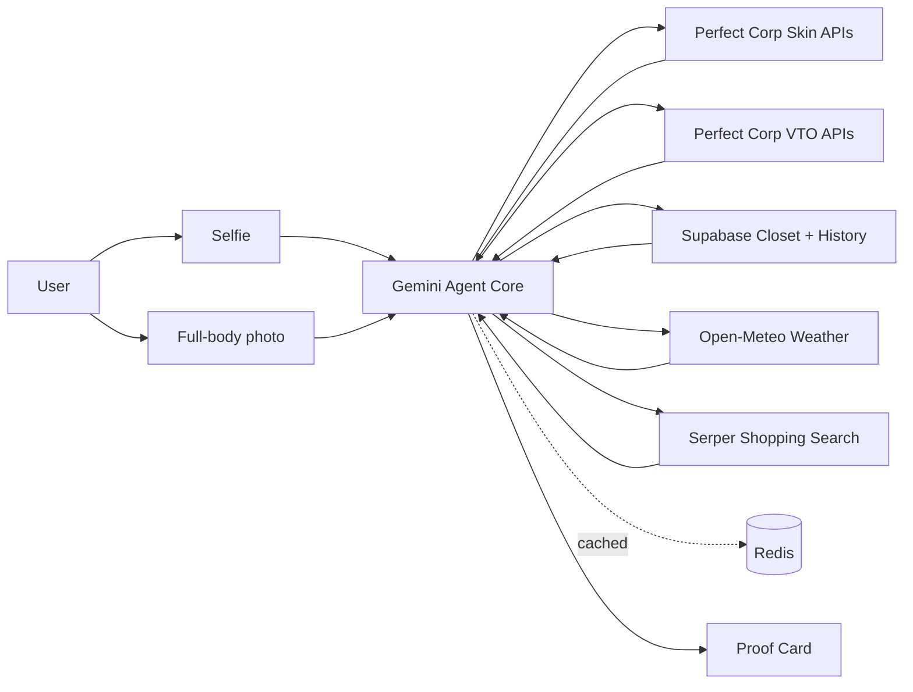

# MirraAI — Your AI Lifestyle Mirror

> Two photos. One AI agent. A transparent Proof Card backs every recommendation before you spend a cent.

MirraAI is an agentic beauty, skin, closet, and shopping companion built for **The Silicon Valley Hackathon: Perfect Corp x Startup World Cup**. A selfie and a full-body photo power skin analysis, persona-aware GlowUp recommendations, virtual try-ons, closet-first outfit matching, shopping gap fill, and proof-based purchase decisions.

## What It Does

- **Selfie capture** powers skin analysis, skin tone, face attributes, makeup VTO, hairstyle VTO, earrings VTO, and necklace VTO.
- **Full-body capture** powers clothes virtual try-on in the Try-On Studio.
- **Skin Health** shows 14 Perfect Corp skin concern scores, history, weather-aware insights, and before/after simulation.
- **GlowUp Studio** recommends makeup, grooming polish, hairstyles, and accessories using face shape, undertone, and persona signals.
- **Smart Closet** stores wardrobe items with AI-generated metadata for category, color, style, and occasion matching.
- **Outfit Builder** starts from what the user already owns, identifies gaps, finds real products through Serper, and validates the look with VTO.
- **Proof Card** summarizes tone match, style fit, skin safety, closet-owned items ($0), new items, and total spend.

## Agentic AI Flow

Perfect Corp provides the analysis and rendering tools. Gemini acts as the planner on top:

1. Reads skin scores, tone, face attributes, closet metadata, history, weather, and product search results.
2. Chooses the right tool path for the user goal.
3. Returns structured JSON with `steps`, `insight`, `recommendations`, and `tool_calls_made`.
4. Surfaces a visible reasoning trace in the UI so users can see why a recommendation was made.
5. Emits sanitized in-app actions such as `/skin/simulate`, `/try-on`, or `/outfit`.
6. Falls back to deterministic planners when Gemini is unavailable so the experience never goes blank.

## Perfect Corp APIs

MirraAI uses 9 Perfect Corp APIs across skin intelligence and virtual try-on.

### Skin Intelligence

- **AI Skin Analysis** — 14 skin concern scores for the health dashboard.
- **AI Skin Tone** — undertone and color profile for makeup and fashion logic.
- **AI Face Attributes** — face shape and gender/persona signals for GlowUp planning.
- **AI Skin Simulation** — before/after visualization for skin improvement goals.

### Virtual Try-On

- **AI Clothes VTO** — outfit rendering on a full-body photo.
- **AI Makeup VTO** — face-aware makeup or grooming-polish application.
- **AI Hairstyle VTO** — hairstyle transfer using selfie references.
- **AI Earrings VTO** — accessory rendering for complete look building.
- **AI Necklace VTO** — necklace rendering for outfit completion.

## Tech Stack

| Layer | Tech |
| --- | --- |
| Frontend | Next.js 16, React 19, TypeScript, Tailwind CSS, PWA |
| Backend | FastAPI, Python 3.12+ |
| Agent Core | Google Gemini 2.5 Flash, structured JSON, Pydantic validation |
| AI / AR Tools | Perfect Corp S2S APIs with async task polling |
| Shopping | Serper |
| Weather Context | Open-Meteo |
| Data | Supabase Postgres, Auth, Storage |
| Cache | Redis |
| Deployment | Vercel frontend, DigitalOcean backend |

## Architecture



## Quick Start

### Backend

```bash
cd backend
cp .env.example .env
pip install -r requirements.txt
uvicorn app.main:app --reload --port 8000
```

Add the required API keys and service URLs to `backend/.env` before running real API flows.

### Frontend

```bash
cd frontend
npm install
npm run dev
```

The local app runs on the Next.js dev server. Configure `frontend/.env.local` with the backend URL and Supabase client settings.

## Verification

```bash
# Backend tests
cd backend
python3 -m pytest -q

# Backend import smoke test
python3 -c "import app; print('backend imports ok')"

# Frontend production build
cd ../frontend
npm run build
```

Latest local verification:

- Backend test suite: `40 passed`
- Backend import sweep: `ALL IMPORTS OK`
- Frontend production build: successful

## Project Structure

```text
mirra-ai/
├── backend/
│   └── app/
│       ├── core/       # config, auth, validation, constants
│       ├── data/       # curated presets and static catalogs
│       ├── routers/    # FastAPI route handlers
│       ├── services/   # Perfect Corp, Gemini agent, Serper, proof cards
│       └── tools/      # skin, beauty, fashion, and VTO orchestration
├── frontend/
│   └── src/
│       ├── app/        # Next.js app routes
│       ├── components/ # UI and domain components
│       ├── hooks/      # camera, image transitions, app data hooks
│       ├── lib/        # API client, adapters, utilities
│       └── types/      # shared frontend types
└── docs/               # product docs, tasks, source-of-truth notes
```

## Key Routes

- `/dashboard` — user overview and AI insights.
- `/skin` — skin scores, trends, weather-aware reasoning.
- `/skin/simulate` — skin improvement simulation.
- `/glowup` — persona-aware makeup/grooming, hair, and accessory planning.
- `/closet` — wardrobe upload and metadata.
- `/outfit` — closet-first outfit builder and shopping gap fill.
- `/try-on` — unified clothes, makeup, hair, earrings, and necklace VTO studio.
- `/outfit-history` and `/look-diary` — saved looks and proof cards.

## Docs

- [PRD.md](docs/PRD.md) — product requirements and API integration details.
- [TASKS.md](docs/TASKS.md) — implementation tracker.
- [PERFECT_CORP_API_SOURCE_OF_TRUTH.md](docs/PERFECT_CORP_API_SOURCE_OF_TRUTH.md) — Perfect Corp integration notes.
